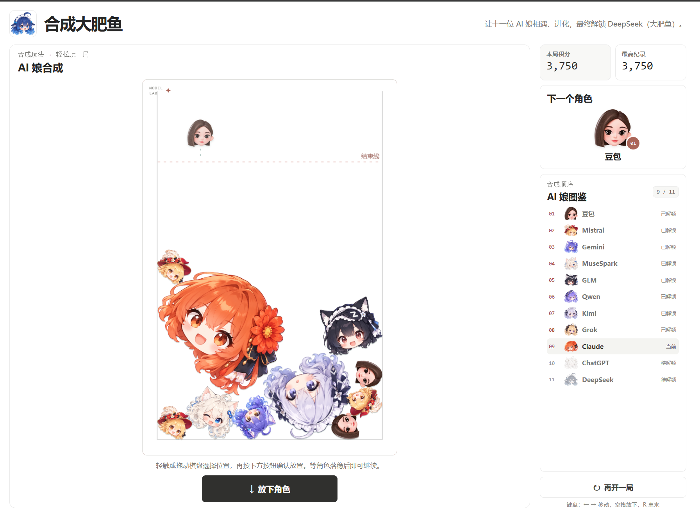
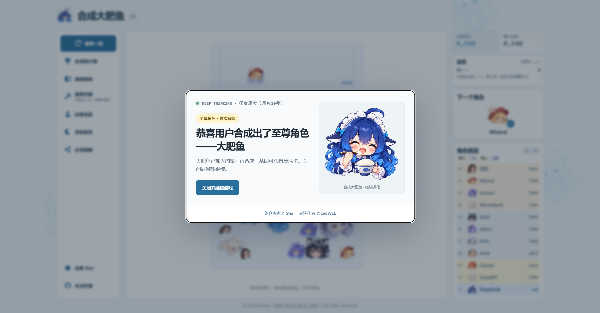
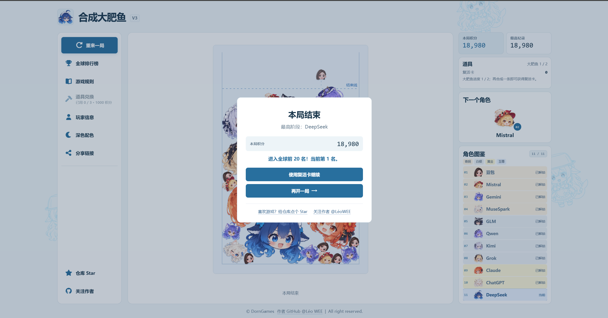

# 合成大肥鱼

**版本：V3.1**

一款在浏览器中游玩的合成游戏。把相同角色合在一起，一路进化，合成大肥鱼！
- [开始游戏](https://koloyaaa.github.io/DaFeiYu/)
- [反馈问题](https://github.com/Koloyaaa/DaFeiYu/issues)
- [关注作者 LéoWEE](https://github.com/Koloyaaa)
- [给游戏仓库点 Star](https://github.com/Koloyaaa/DaFeiYu)

## 游戏画面

## 玩法

相同角色碰到后会自动合成。角色会受重力和碰撞影响；当角色在结束线上方稳定停留一段时间，本局结束。合成大肥鱼后游戏不会重开，可以继续游玩。

每次放下一只角色后，要等它碰到其他角色或池底才能继续放置；两次放置至少间隔 0.35 秒。新角色从前六阶中随机出现，概率依次为：豆包 40%、Mistral 25%、Gemini 16%、MuseSpark 10%、GLM 6%、Qwen 3%。

两次合成相隔不超过 0.35 秒视为连续消除；达到 3 连及以上时会显示提示，并使本轮基础合成积分额外增加 10%。

| 操作 | 方法 |
| --- | --- |
| 鼠标 | 移动选择位置，点击放下角色。 |
| 触屏 | 轻点放下；也可按住拖动选择位置，松手放下。 |
| 键盘 | 使用 `←` / `→` 移动，按 `Space` 放下。 |
| 重锤 | 选中重锤后点击棋盘中的角色；键盘可用方向键瞄准、`Enter` 砸击、`Esc` 取消。 |

## 道具

- 每局最多使用 3 次重锤；每次成功砸中角色会消耗 2000 本局积分。
- 每合成两条大肥鱼可获得一张复活卡。
- 使用复活卡会清理结束线附近的角色，并让本局重锤可用次数增加 2 次。
- 道具进度和复活卡保存在当前浏览器中。

## 角色与成就

角色按以下顺序进化：

豆包 → Mistral → Gemini → MuseSpark → GLM → Qwen → Kimi → Grok → Claude → ChatGPT → DeepSeek

角色图鉴用不同底色标示青铜 4 位、白银 4 位、黄金 2 位和至尊 1 位。DeepSeek（大肥鱼）属于至尊。每局首次合成黄金或至尊角色时会出现庆祝弹窗；同一角色在新的一局还会再次庆祝。

## 排行榜与玩家信息

开始游戏前需要设置昵称和头像。它们保存在当前浏览器；排行榜只展示前 20 名，只有成绩进入榜单时，昵称、头像和成绩才会提交到全球榜单。昵称允许重名，成绩会分别记录；已上榜用户修改昵称或头像后会同步更新榜单资料。老用户原有的本地最高纪录会继续保留，但不会计入全球排行榜。

## 页面功能

- 桌面端的左侧快捷栏提供排行榜、道具、重开、玩家信息、配色切换和分享入口。
- 移动端使用同一组顶部图标；按钮文字会隐藏。
- 页面支持浅色和深色配色，首次访问时跟随设备外观设置，之后会记住你的选择。
- 分享按钮会打开设备的分享面板；设备不支持时会尝试复制游戏链接。
- 游戏结束后可以保存整页战绩截图，图片不包含游戏结束弹窗。

## 致谢

- [YHSome/BigNaiWa](https://github.com/YHSome/BigNaiWa)
- [bullhe4d/bigwatermelon](https://github.com/bullhe4d/bigwatermelon)
- [liyupi/daxigua](https://github.com/liyupi/daxigua)
- [O2Team](https://github.com/o2team/o2team.github.io)

## 许可

本项目使用 MIT License，详见 [`LICENSE`](LICENSE)。
